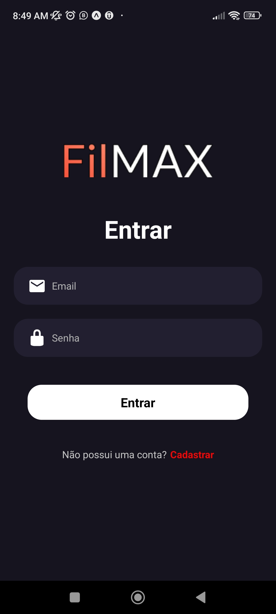

<h1 align="center">FilMAX</h1>

Final project for the React Native discipline in the Serratec course. Filmax is a movie info based app, here you can log in, log out, edit your profile, and check movies info.

Tecnologies:
 React Native
 EmailJS
 Axios
 Git e GitHub

